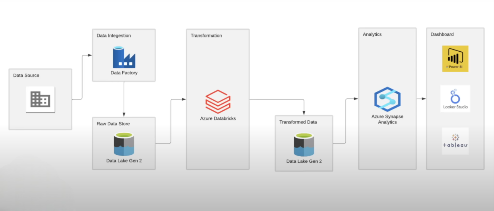
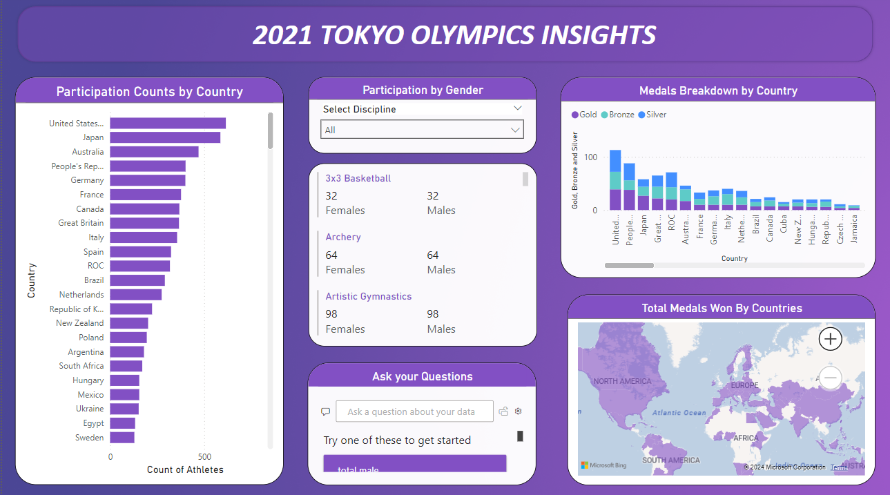
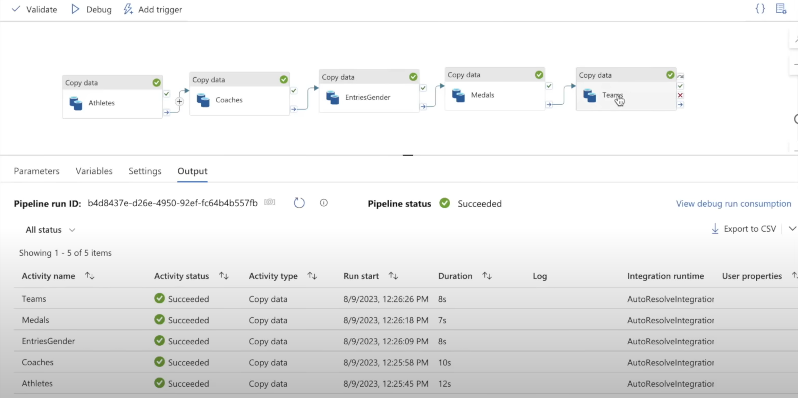
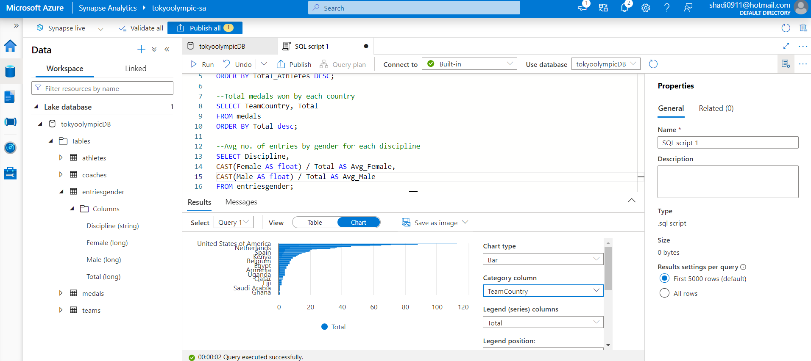

# Tokyo Olympics Data Engineering and Analytics | Microsoft Azure and Power BI Project

## Introduction
This project showcases the application of data engineering and analytics techniques to explore insights from the Tokyo Olympics using Microsoft Azure and Power BI. I have utilized tools like Azure Data Factory for data pipelines, Databricks for data transformation, Synapse Analytics for querying, ADLS for storage, and Power BI for visualization, enabling insightful analysis of Olympic performance.

## Architecture

## Technology Used
+ Microsoft Azure
  - Azure Data Lake Storage Gen 2 (ADLS)
    
    > Created a storage account for storing the raw data and transformed data.
  - Azure Data Factory (ADF)

    > Used to create a simple pipeline to extract the raw data from its source and load it into raw data store in ADLS.
  - Databricks

    > Used to perform some basic transformation on raw data, by mounting ADLS to Databricks for accessing the data. The transformed data is loaded into transformed data store in ADLS.
  - Azure Synapse Analytics

    >Used to write SQL queries to draw useful insights from the transformed data. 
+ Microsoft Power BI

  >Connected Power BI with ADLS to import data and visualize it. Created a report for understanding the data better.

## Dataset Used 
2021 Olympics in Tokyo - Data about Athletes, Teams, Coaches, Events
 This dataset contains the details of over 11,000 athletes, with 47 disciplines, along with 743 Teams taking part in the 2021(2020) Tokyo Olympics.
 It contains the details of the Athletes, Coaches, Teams participating, Medals won as well as the Entries by gender. It contains their names, countries represented, discipline, gender of competitors, name of the coaches.

 Here is the link to dataset used in this project: (https://github.com/Mohamed-Shadi/azure-project1-tokyoolympics/tree/main/data)
 Original Dataset link - (https://www.kaggle.com/datasets/arjunprasadsarkhel/2021-olympics-in-tokyo)

## Scripts
+ [Transformation Code](https://github.com/Mohamed-Shadi/azure-project1-tokyoolympics/blob/main/Tokyo%20Olympic%20Transformation.ipynb)

## Power BI Report

Link: (https://github.com/Mohamed-Shadi/azure-project1-tokyoolympics/blob/main/tokyoolympic-pbi.pbix)

## Other Project Execution Screenshots

